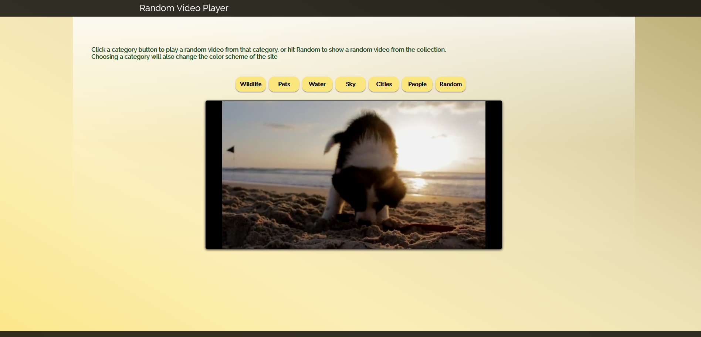

# Random-Video-Player
A JavaScript project for altering css and loading videos

## Function

This is a one page website using Html, CSS and JavaScript to create a way to randomly access videos among a preset set of videos.
It is a personal project built as a way to practice using JavaScript to alter CSS elements within a page, and to practice displaying videos using JavaScript.
There are six category buttons and one button marked 'Random'. Clicking a category button will play a video from that category. Clicking 'Random' will play a video randomly chosen from the whole set.
Each category has a color scheme associated with it and clicking a category button will also change the color scheme. Clicking 'Random' will reset the colors back to the default appearance.

## Contents

- main.css defines the CSS for the page
- index.html defines the HTML elements
- videoSources.txt is a record of the source pages where each video can be accessed (although they are accessed in the .js file through their direct URL, not their source URL).
- video.js defines a 2D Array to contain the video URLs. defines two functions:
  - playVid(): receives a parameter 'choice' which is a numerical value representing which button was pressed. It uses a switch statement to pass the associated color parameters to colorChange(). It then generates random numbers for the category and / or video depending on which button has been clicked and alters the src URL of the video before reloading and playing that video.  
  - colorChange(): receives as parameters four strings for dark, medium, light, and gradient colours. It retreives all objects in the affected classes and applies the style changes.

  ## Video Link -   https://youtu.be/9U4g-oziByo

